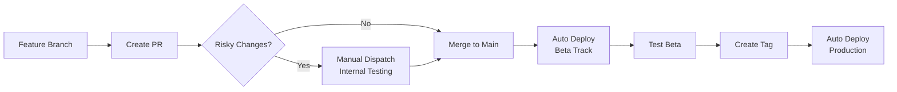

# 🚀 Quick Workflow Reference

## 🔄 Development Flow



## 📱 Quick Commands

### Local Testing
```bash
./gradlew installDevDebug  # Install dev version locally
```

### Internal Testing (Risky Changes)
```bash
gh workflow run cd.yml --ref your-branch-name
```

### Beta Deployment
```bash
git push origin main  # Automatic after PR merge
```

### Production Release
```bash
git tag v1.4.0 && git push origin v1.4.0  # Automatic deployment
```

## 🎯 Deployment Targets

| Action | Track | Audience | When to Use |
|--------|-------|----------|-------------|
| Manual dispatch | Internal | Team only | Risky changes |
| Push to main | Beta | Public beta | Stable features |
| Version tag | Production | All users | Ready releases |

## 📋 Pre-Release Checklist

- [ ] Update CHANGELOG.md "Unreleased" section
- [ ] Test locally or internally if risky
- [ ] Merge to main (auto-deploys to beta)
- [ ] Test beta version thoroughly
- [ ] Move changelog content to version section
- [ ] Create version tag (auto-deploys to production)
