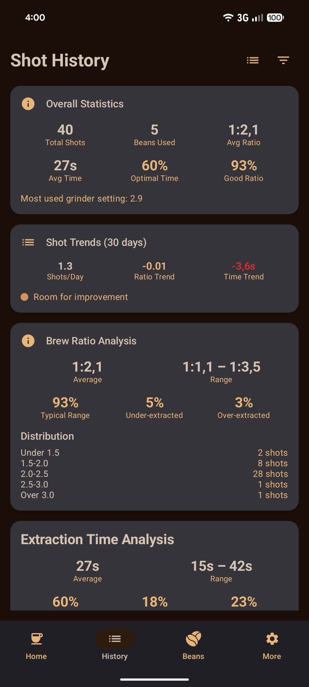

# Coffee Shot Timer

<p align="center">
  
</p>

<p align="center">
  <strong>Espresso timer with analytics for home baristas</strong>
</p>

## Overview

Coffee Shot Timer is a precision Android app designed specifically for espresso machine enthusiasts who want to systematically improve their brewing skills. The app combines intelligent timing with detailed data capture to help you achieve consistent, perfect espresso extractions.

## Features

### 🎯 **Precision Timer with Visual Feedback**
- Large, touch-friendly timer display with color-coded visualization
- Optimal extraction times signaled through intuitive color changes
- Instant feedback on shot quality during extraction

### ⚖️ **Weight Documentation & Brew Ratio Tracking**
- Track coffee input and espresso output with intuitive sliders
- Automatic brew ratio calculations
- Visual indicators for hitting the perfect extraction sweet spot

### ☕ **Smart Bean Management**
- Comprehensive coffee bean tracking with roast dates
- Automatic freshness indicators
- Notifications for optimal brewing windows

### 📊 **Comprehensive Shot Documentation**
- Record grinder settings, extraction times, and tasting notes
- Complete parameter logging for every shot
- Never forget a successful setup again

### 📈 **Analysis & Optimization Tools**
- Visualize brewing patterns over time
- Spot trends and improvement opportunities
- Historical data to reproduce and develop successful settings

### 🚀 **Designed for Daily Use**
- **100% Offline functionality** - works perfectly without WiFi
- Automatic draft saving prevents data loss
- Quick input workflow optimized for active brewing
- Large interface elements for stress-free operation

## Screenshots

<p align="center">
  
  
  
  
</p>

<p align="center">
  
  
  
</p>

## Perfect For

- ☕ Espresso machine or manual espresso maker owners
- 🎯 Coffee enthusiasts wanting reproducible results
- 📚 Systematic learners who like data-driven improvement
- 🔧 Baristas looking to refine their technique
- 🏠 Home coffee enthusiasts serious about quality

## Technology Stack

This is an Android application built with:
- **Kotlin** - Primary programming language
- **Android Gradle Plugin** - Build system
- **Hilt** - Dependency injection
- **Room Database** - Local data storage

## Getting Started

### Prerequisites
- Android Studio
- Android SDK
- Gradle

### Building the Project

1. Clone the repository:
```bash
git clone https://github.com/jodli/CoffeeShotTimer.git
cd CoffeeShotTimer
```

2. Open the project in Android Studio

3. Build the project:
```bash
./gradlew build
```

4. Run on device or emulator:
```bash
./gradlew installDebug
```

### Release Build

The project includes configuration for release builds. A pre-built release is available in `app/release/app-release.aab`.

## Project Structure

```
app/src/main/           # Main application source code
app/src/test/           # Unit tests
app/src/androidTest/    # Instrumentation tests
docs/                   # Documentation and screenshots
gradle/                 # Gradle configuration
```

## Contributing

Contributions are welcome! Please feel free to submit a Pull Request. For major changes, please open an issue first to discuss what you would like to change.

## License

This project is licensed under the terms found in the [LICENSE](LICENSE) file.

## Philosophy

Coffee Shot Timer transforms espresso making from guesswork into precise craftsmanship - without any stress. The app supports you in achieving consistent espresso quality and developing your personal taste preferences through a structured, data-driven approach.

---

<p align="center">
  Made with ☕ for the home barista community
</p>
