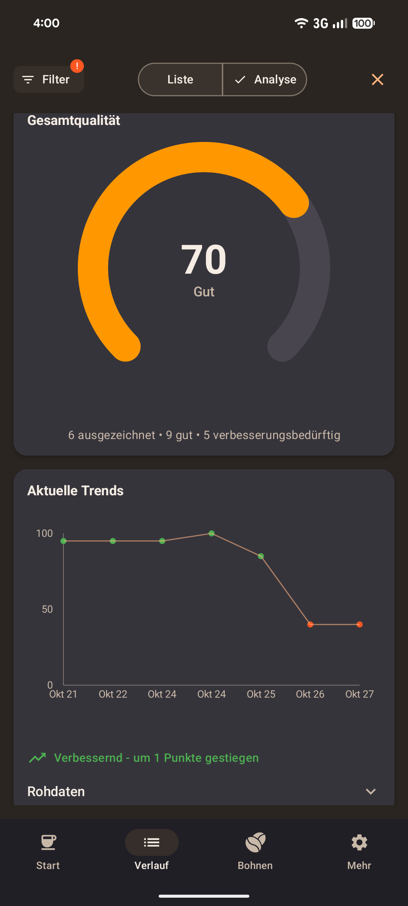
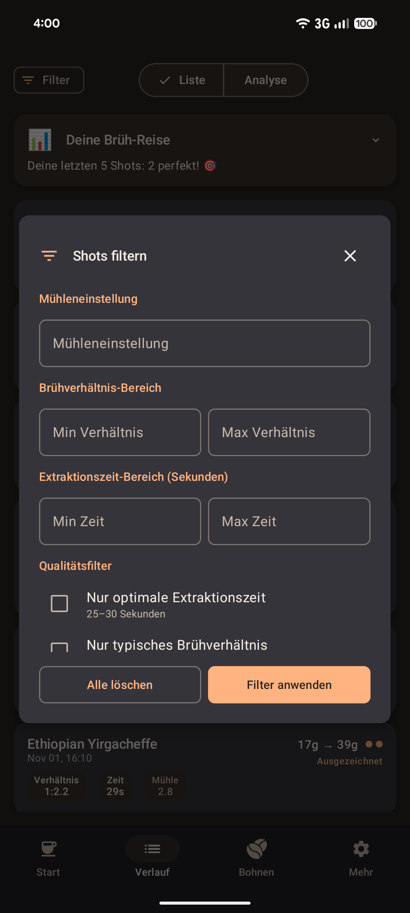
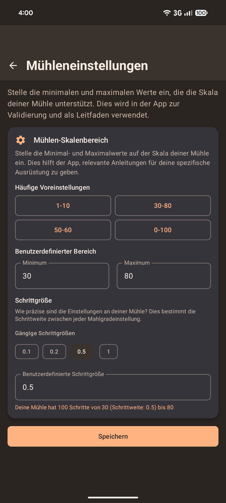

# Store entry for de-DE
## App-Name
Coffee Shot Timer

## Kurzbeschreibung
Espresso-Timer mit Analyse für Heim-Baristas

## Vollständige Beschreibung

Die Präzisions-App für perfekte Espresso-Extraktion

Coffee Shot Timer wurde speziell für Espressomaschinen-Enthusiasten entwickelt, die ihre Brühfähigkeiten systematisch auf das nächste Level bringen möchten. Die App kombiniert intelligente Zeitmessung mit detaillierter Datenerfassung, um Ihnen zu helfen, konsistente, perfekt abgestimmte Espresso-Extraktionen zu erreichen.

Was Sie erwarten können:

Präzisions-Timer mit visueller Rückmeldung: Großes, berührungsfreundliches Timer-Display mit farbkodierter Visualisierung. Optimale Extraktionszeiten werden durch Farbwechsel signalisiert - Sie wissen sofort, wann Ihr Shot perfekt läuft.

Brühverhältnis-Verfolgung: Verfolgen Sie Kaffee-Input und Espresso-Output über intuitive Schieberegler, die Single-Shot-Siebträger unterstützen (ab 5g). Die App berechnet automatisch Ihr Brühverhältnis und zeigt Ihnen, wann Sie den Sweet Spot treffen.

Intelligente Bohnenverwaltung: Verwalten Sie Ihre Kaffeebohnen mit Röstdaten und automatischen Frische-Indikatoren. Fügen Sie Fotos der Bohnenverpackung hinzu für einfacheres Nachkaufen. Die App lässt Sie wissen, wann Bohnen noch zu frisch oder bereits über ihre beste Zeit hinaus sind.

Umfassende Shot-Protokollierung: Erfassen Sie Mühleneinstellungen, Extraktionszeiten und Verkostungsnotizen. Jeder Shot wird mit allen relevanten Parametern gespeichert - so vergessen Sie nie wieder eine erfolgreiche Einstellung.

Analyse und Optimierung: Visualisieren Sie Ihre Brühmuster über die Zeit und erkennen Sie Trends. Die Verlaufsfunktion hilft Ihnen, erfolgreiche Einstellungen mit konsistenter Shot-Analyse zu reproduzieren und weiterzuentwickeln.

Ausrüstungs-Setup: Konfigurieren Sie Ihren Mühlen-Skalenbereich, um die App an Ihre spezifische Ausrüstung anzupassen und relevante Anleitungen für Ihr Setup zu erhalten.

Anfängerfreundliches Onboarding: App-Einführung und geführte Einrichtung für eine reibungslose erste Nutzung, die es Neulingen leicht macht, zu beginnen.

Für den täglichen Gebrauch konzipiert:
- Funktioniert 100% offline - perfekt auch ohne WLAN
- Automatisches Entwurf-Speichern verhindert Datenverlust
- Schnelle Eingabe während des aktiven Brühens
- Große Bedienelemente für entspannte, stressfreie Bedienung
- Optimierte Navigation und schnelle Benutzeroberfläche

Perfekt geeignet, wenn Sie:
- Eine Espressomaschine oder manuelle Espresso-Zubereitung besitzen
- Reproduzierbare Ergebnisse wollen
- Gerne systematisch mit datengestützter Verbesserung lernen
- Ihre Technik verfeinern möchten
- Ernsthaft an hochwertigen Heim-Kaffee interessiert sind

Die App unterstützt Sie dabei, konsistente Espresso-Qualität zu erreichen und Ihre persönlichen Geschmackspräferenzen zu entwickeln. Durch den strukturierten Ansatz verbessern Sie schrittweise Ihre Brühfähigkeiten.

Coffee Shot Timer verwandelt Espresso-Zubereitung von Rätselraten in präzises Handwerk - ganz ohne Stress.

## App icon

## App banner

## Screenshots

