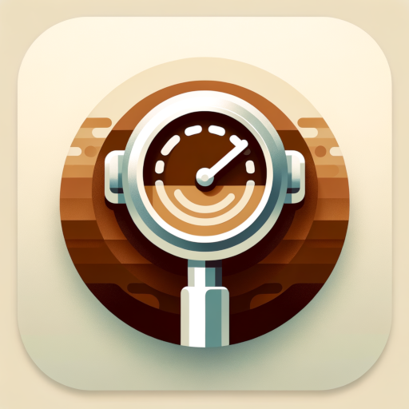
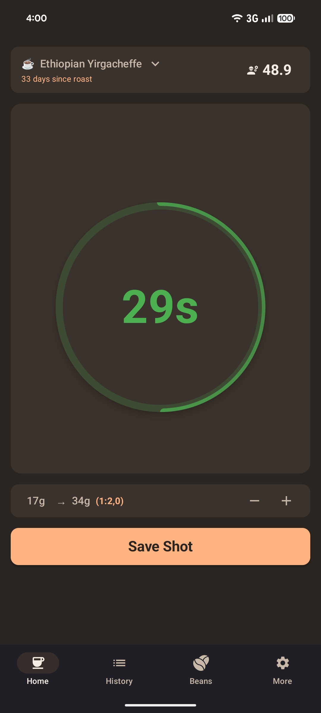
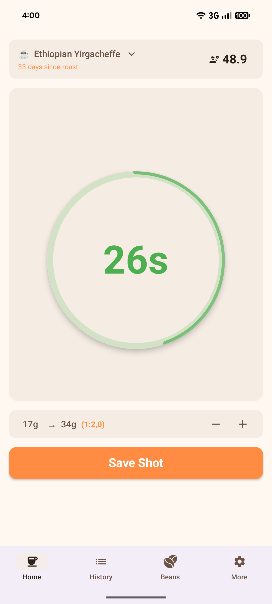
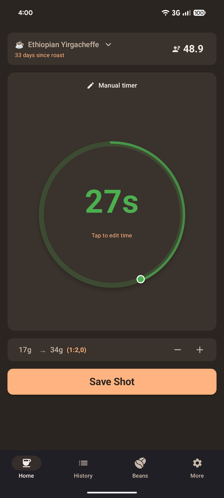
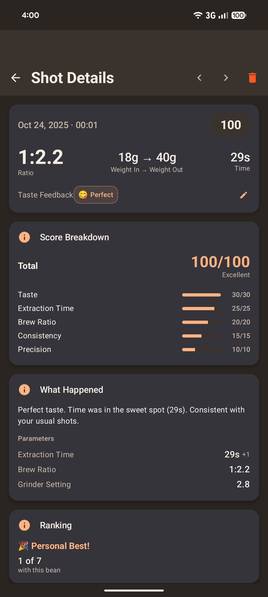
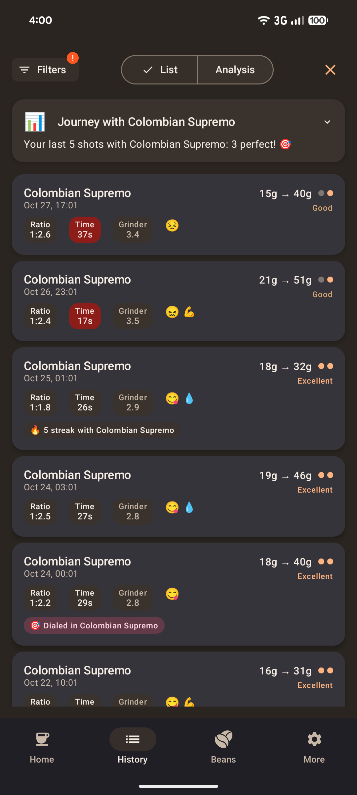
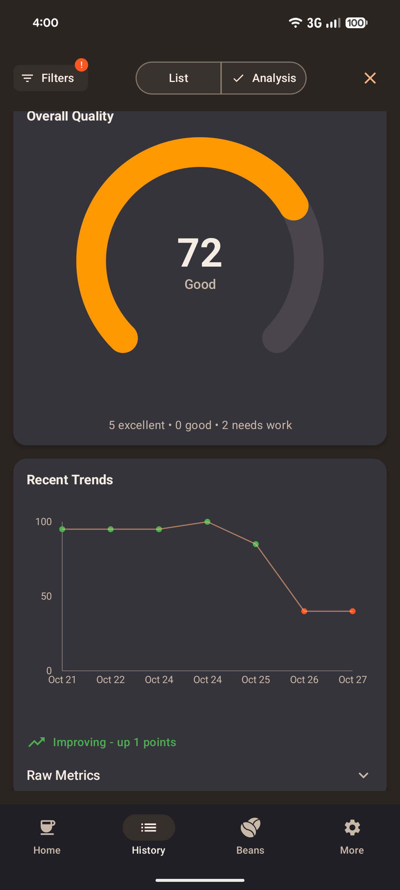
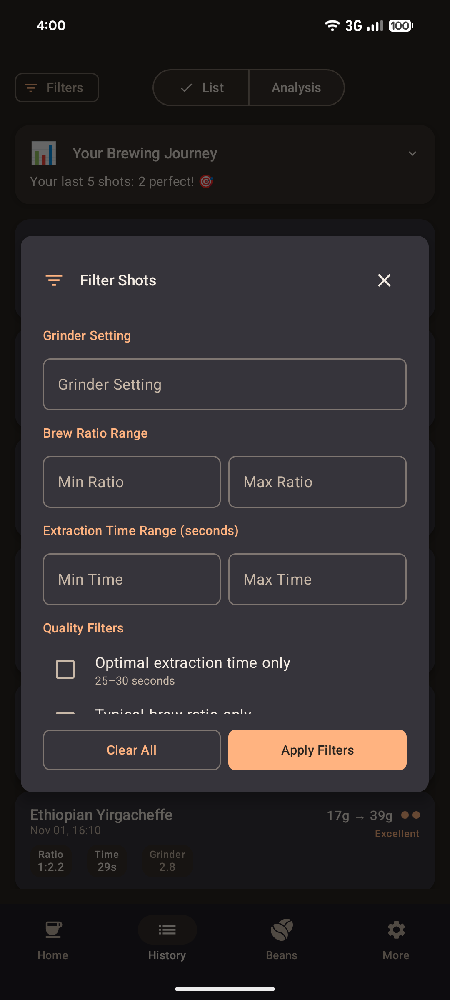
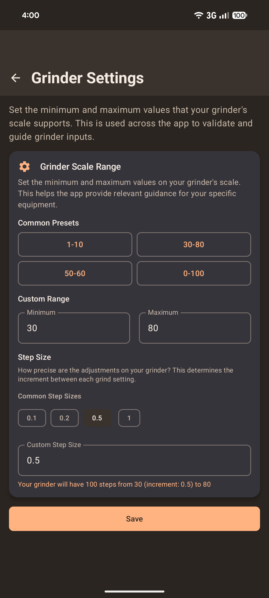

# Store entry for en-US
## App-Name
Coffee Shot Timer

## Short description
Espresso timer with analytics for home baristas

## Full description

The precision app for perfect espresso extraction

Coffee Shot Timer was built specifically for espresso machine enthusiasts who want to systematically take their brewing skills to the next level. The app combines intelligent timing with detailed data capture to help you achieve consistent, dialed-in espresso extractions.

What you can expect:

Precision timer with visual feedback: Large, touch-friendly timer display with color-coded visualization. Optimal extraction times are signaled through color changes - you'll instantly know when your shot is running perfectly.

Brew ratio tracking: Track coffee input and espresso output through intuitive sliders that support single-shot baskets (down to 5g). The app automatically calculates your brew ratio and shows you when you're hitting the sweet spot.

Smart bean management: Manage your coffee beans with roast dates and automatic freshness indicators. Attach photos of bean packages for easier re-purchasing. The app lets you know when beans are still too fresh or past their prime.

Comprehensive shot logging: Record grinder settings, extraction times, and tasting notes. Every shot is saved with all relevant parameters - so you'll never forget a successful setup again.

Analysis and optimization: Visualize your brewing patterns over time and spot trends. The history feature helps you reproduce and develop successful settings with consistent shot analysis.

Equipment setup: Configure your grinder scale range to tailor the app to your specific equipment and get relevant guidance for your setup.

Beginner-friendly onboarding: App introduction and guided setup for a smooth first-run experience, making it easy for newcomers to get started.

Designed for daily use:
- Works 100% offline - perfect even without WiFi
- Automatic draft saving prevents data loss
- Quick input during active brewing
- Large interface elements for relaxed, stress-free operation
- Streamlined navigation and fast UI

Perfect fit if you:
- Own an espresso machine or manual espresso maker
- Want reproducible results
- Like to learn systematically with data-driven improvement
- Want to refine your technique
- Are serious about home coffee quality

The app supports you in achieving consistent espresso quality and developing your personal taste preferences. Through the structured approach, you'll gradually improve your brewing skills.

Coffee Shot Timer transforms espresso making from guesswork into precise craftsmanship - without any stress.

## App icon

## App banner

## Screenshots

