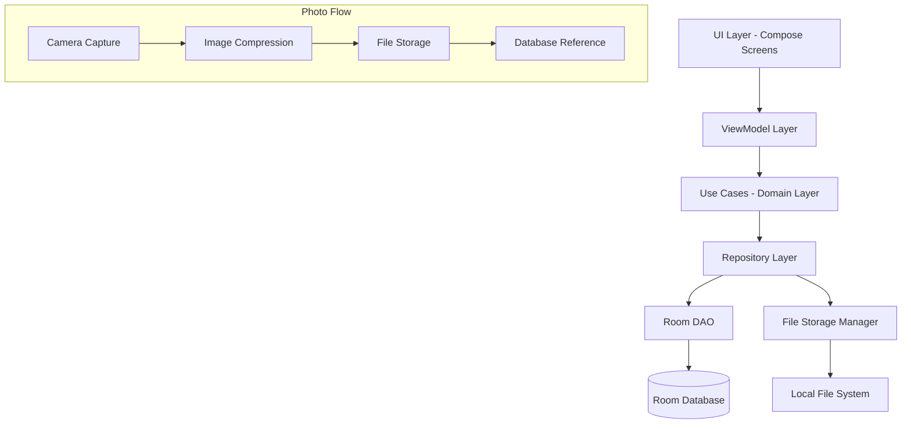

# Design Document

## Overview

This design document outlines the implementation approach for Milestone 1 of the Bean Photo & Sharing feature: Bean Photo Capture & Storage. The feature enables users to capture and store a single photo per coffee bean, integrating seamlessly with the existing bean management workflow while maintaining the app's offline-first architecture and Material 3 design system.

The design leverages the existing bean-centric data model and Room database infrastructure, adding photo storage capabilities through local file management and database schema extensions.

## Architecture

### High-Level Architecture



### Data Flow

1. **Photo Capture**: User initiates photo capture through UI
2. **Image Processing**: Captured image is compressed and optimized
3. **File Storage**: Processed image is saved to local app storage
4. **Database Update**: Bean record is updated with photo file reference
5. **UI Update**: Photo is displayed in bean details view

## Components and Interfaces

### 1. Data Layer Extensions

#### Bean Entity Update
```kotlin
@Entity(tableName = "beans")
data class Bean(
    // ... existing fields ...
    val photoPath: String? = null  // New field for photo file path
)
```

#### BeanDao Extensions
```kotlin
@Dao
interface BeanDao {
    // ... existing methods ...
    
    @Query("UPDATE beans SET photoPath = :photoPath WHERE id = :beanId")
    suspend fun updateBeanPhoto(beanId: String, photoPath: String?)
}
```

#### Database Migration
```kotlin
val MIGRATION_1_2 = object : Migration(1, 2) {
    override fun migrate(database: SupportSQLiteDatabase) {
        database.execSQL("ALTER TABLE beans ADD COLUMN photoPath TEXT DEFAULT NULL")
    }
}
```

### 2. File Storage Manager

#### PhotoStorageManager Interface
```kotlin
interface PhotoStorageManager {
    suspend fun savePhoto(imageUri: Uri, beanId: String): Result<String>
    suspend fun deletePhoto(photoPath: String): Result<Unit>
    suspend fun getPhotoFile(photoPath: String): File?
    suspend fun compressImage(imageUri: Uri): Result<Uri>
}
```

#### Implementation Responsibilities
- **File Naming**: Use bean ID + timestamp for unique file names
- **Compression**: Reduce image size while maintaining quality for identification
- **Storage Location**: Use app's private storage directory
- **Cleanup**: Handle orphaned files and storage management

### 3. Camera Integration

#### PhotoCaptureManager Interface
```kotlin
interface PhotoCaptureManager {
    fun createImageCaptureIntent(): Intent
    fun createImagePickerIntent(): Intent
    fun handleCameraPermission(context: Context): Boolean
}
```

#### Camera Permission Handling
- Request CAMERA permission when needed
- Graceful fallback to gallery selection
- Clear user messaging about permission requirements

### 4. Domain Layer

#### Use Cases
```kotlin
class AddPhotoToBeanUseCase(
    private val beanRepository: BeanRepository,
    private val photoStorageManager: PhotoStorageManager
) {
    suspend fun execute(beanId: String, imageUri: Uri): Result<String>
}

class RemovePhotoFromBeanUseCase(
    private val beanRepository: BeanRepository,
    private val photoStorageManager: PhotoStorageManager
) {
    suspend fun execute(beanId: String): Result<Unit>
}

class GetBeanPhotoUseCase(
    private val photoStorageManager: PhotoStorageManager
) {
    suspend fun execute(photoPath: String): Result<File>
}
```

### 5. UI Layer Updates

#### AddEditBeanScreen Enhancements
- **Photo Section**: Add photo capture/display section after grinder setting
- **Photo Actions**: Camera capture, gallery selection, photo replacement, photo deletion
- **Photo Display**: Show current photo with edit/delete options
- **Empty State**: Show placeholder when no photo is present

#### Photo Components
```kotlin
@Composable
fun BeanPhotoSection(
    photoPath: String?,
    onAddPhoto: () -> Unit,
    onReplacePhoto: () -> Unit,
    onDeletePhoto: () -> Unit,
    onViewPhoto: () -> Unit
)

@Composable
fun PhotoActionSheet(
    onCameraCapture: () -> Unit,
    onGallerySelect: () -> Unit,
    onDismiss: () -> Unit
)

@Composable
fun PhotoViewer(
    photoPath: String,
    onDismiss: () -> Unit
)
```

## Data Models

### Updated Bean Entity
```kotlin
@Entity(
    tableName = "beans",
    indices = [
        Index(value = ["name"], unique = true),
        Index(value = ["isActive"]),
        Index(value = ["roastDate"]),
        Index(value = ["createdAt"]),
        Index(value = ["photoPath"])  // New index for photo queries
    ]
)
data class Bean(
    @PrimaryKey
    val id: String = UUID.randomUUID().toString(),
    val name: String,
    val roastDate: LocalDate,
    val notes: String = "",
    val isActive: Boolean = true,
    val lastGrinderSetting: String? = null,
    val photoPath: String? = null,  // New field
    val createdAt: LocalDateTime = LocalDateTime.now()
)
```

### Photo Storage Structure
```
/data/data/com.jodli.coffeeshottimer/files/photos/
├── {beanId}_photo.jpg
├── {beanId}_photo.jpg
└── ...
```

### File Naming Convention
- **Format**: `{beanId}_photo.jpg`
- **Benefits**: Easy cleanup, unique per bean, simple lookup
- **Compression**: JPEG format with 85% quality for optimal size/quality balance

## Error Handling

### Photo Capture Errors
- **Camera Unavailable**: Fallback to gallery selection
- **Permission Denied**: Show explanation and settings redirect
- **Storage Full**: Clear error message with cleanup suggestions
- **File Corruption**: Graceful handling with retry options

### Storage Errors
- **Disk Space**: Check available space before saving
- **File Access**: Handle permission and file system errors
- **Cleanup**: Remove orphaned files during app maintenance

### UI Error States
- **Loading States**: Show progress during photo operations
- **Error Messages**: Clear, actionable error descriptions
- **Retry Mechanisms**: Allow users to retry failed operations
- **Graceful Degradation**: App remains functional without photos

## Testing Strategy

### Unit Tests
- **PhotoStorageManager**: File operations, compression, cleanup
- **Use Cases**: Business logic for photo operations
- **Bean Entity**: Validation with photo field
- **ViewModel**: Photo state management and user interactions

### Integration Tests
- **Database Migration**: Verify schema update from v1 to v2
- **File Storage**: End-to-end photo save/retrieve operations
- **Camera Integration**: Mock camera operations and permission handling

## Implementation Phases

### Phase 1: Data Layer Foundation
1. **Database Migration**: Add photoPath field to Bean entity
2. **PhotoStorageManager**: Implement file storage operations
3. **Repository Updates**: Add photo-related methods to BeanRepository
4. **Use Cases**: Implement photo management use cases

### Phase 2: Camera Integration
1. **PhotoCaptureManager**: Implement camera and gallery integration
2. **Permission Handling**: Add camera permission management
3. **Image Compression**: Implement image optimization
4. **Error Handling**: Add comprehensive error management

### Phase 3: UI Integration
1. **Photo Components**: Create reusable photo UI components
2. **AddEditBeanScreen**: Integrate photo section into bean editing
3. **Photo Viewer**: Implement full-screen photo viewing
4. **Loading States**: Add appropriate loading and error states

### Phase 4: Testing & Polish
1. **Unit Tests**: Comprehensive test coverage for all components
2. **Integration Tests**: End-to-end photo workflow testing
3. **UI Polish**: Refine animations, transitions, and user feedback
4. **Performance Optimization**: Optimize image loading and memory usage

## Security Considerations

### File Storage Security
- **Private Storage**: Use app's private directory for photo storage
- **File Permissions**: Ensure photos are not accessible to other apps
- **Cleanup**: Remove photos when beans are deleted

### Privacy Considerations
- **Local Storage**: All photos stored locally, no cloud upload
- **User Control**: Users can delete photos at any time
- **Data Export**: Include photos in any future data export features

## Performance Considerations

### Image Optimization
- **Compression**: JPEG with 85% quality for optimal size/quality
- **Resolution**: Limit maximum resolution to 1920x1080 for storage efficiency
- **Loading**: Use efficient image loading with proper caching

### Memory Management
- **Image Loading**: Load images on-demand with proper disposal
- **Caching**: Implement simple in-memory cache for recently viewed photos
- **Background Processing**: Perform compression on background threads

### Storage Management
- **Cleanup**: Regular cleanup of orphaned photo files
- **Size Monitoring**: Track total photo storage usage
- **User Feedback**: Inform users of storage usage when significant