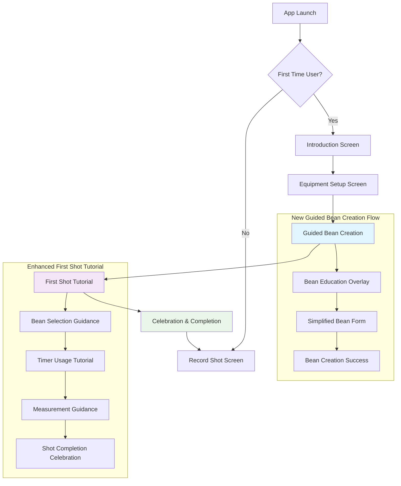

# Onboarding Flow Optimization Design

## Overview

This design addresses the disjointed user experience in the current onboarding flow where users are redirected from equipment setup directly to an empty bean management screen without context or guidance. The optimization creates a more intuitive first-time user journey that naturally guides users through setting up their coffee workflow.

### Current Pain Points

1. **Abrupt Context Switch**: After equipment setup, users are thrown into an empty bean list without explanation
2. **Missing Dependencies**: Users can't start recording shots without beans, creating frustration
3. **Lack of Guidance**: No explanation of what beans are or why they're needed
4. **Workflow Confusion**: The relationship between beans, grinder settings, and shot recording isn't clear

## Design System Integration

This design **strictly follows the existing UI/UX consistency guidelines** established in the Coffee Shot Timer app:

### Existing Component Usage
- **CoffeeCard**: All grouped content uses the standardized card component with 12.dp corners, 4.dp elevation, and `spacing.cardPadding` (16.dp)
- **CoffeePrimaryButton**: All primary actions use the existing button with 44.dp touch targets and `spacing.touchTarget`
- **CoffeeSecondaryButton**: All secondary actions (Skip, Back) use the outlined button style
- **LocalSpacing**: All spacing follows the centralized system (extraSmall: 4.dp, small: 8.dp, medium: 16.dp, large: 24.dp)
- **CardHeader**: Reusable header pattern with icon + title + actions for consistent card layouts
- **GentleValidationMessage**: Existing validation component for user-friendly error messaging

### Coffee-Themed Design Language
- **Color Scheme**: Maintains warm caramel primary, soft teal secondary, creamy beige backgrounds
- **Typography**: Follows existing hierarchy (headlineMedium for titles, titleMedium for sections, bodyMedium for content)
- **Coffee Icons**: Uses existing coffee bean icons and vector resources
- **Material 3**: Consistent with existing Material Design 3 implementation

## Architecture

### Optimized Onboarding Flow



### Integration with Existing Architecture

The optimization builds upon the existing MVVM architecture and adds:

- **OnboardingProgressManager**: Enhanced state management for granular progress tracking
- **GuidedBeanCreationViewModel**: Specialized ViewModel for the bean creation step
- **FirstShotTutorialManager**: Contextual guidance during first shot recording

## Component Design

### 1. Enhanced Onboarding Progress Tracking

```kotlin
data class OnboardingProgress(
    val hasSeenIntroduction: Boolean = false,
    val hasCompletedEquipmentSetup: Boolean = false,
    val hasCreatedFirstBean: Boolean = false,
    val hasRecordedFirstShot: Boolean = false,
    val currentStep: OnboardingStep = OnboardingStep.INTRODUCTION
)

enum class OnboardingStep {
    INTRODUCTION,
    EQUIPMENT_SETUP,
    GUIDED_BEAN_CREATION,
    FIRST_SHOT_TUTORIAL,
    COMPLETED
}
```

### 2. Guided Bean Creation Screen

#### Purpose
Replace the jarring transition to an empty bean list with a guided, educational bean creation experience that explains the importance of bean tracking and helps users create their first bean entry.

#### Component Structure

```kotlin
@Composable
fun GuidedBeanCreationScreen(
    onComplete: (Bean) -> Unit,
    onSkip: () -> Unit,
    viewModel: GuidedBeanCreationViewModel = hiltViewModel()
) {
    val uiState by viewModel.uiState.collectAsState()
    val spacing = LocalSpacing.current
    
    Column(
        modifier = Modifier
            .fillMaxSize()
            .statusBarsPadding()
            .padding(spacing.screenPadding) // Use existing 16.dp screen padding
    ) {
        OnboardingProgressHeader(
            currentStep = 3,
            totalSteps = 4,
            stepTitle = stringResource(R.string.onboarding_guided_bean_creation_title)
        )
        
        when (uiState.currentPhase) {
            BeanCreationPhase.EDUCATION -> BeanEducationContent(
                onContinue = viewModel::proceedToForm,
                onSkip = onSkip
            )
            BeanCreationPhase.FORM -> SimplifiedBeanForm(
                formState = uiState.formState,
                onFieldChange = viewModel::updateField,
                onSubmit = viewModel::createBean,
                onBack = viewModel::returnToEducation
            )
            BeanCreationPhase.SUCCESS -> BeanCreationSuccess(
                createdBean = uiState.createdBean,
                onContinue = { onComplete(uiState.createdBean!!) }
            )
        }
    }
}
```

#### Bean Education Content

```kotlin
@Composable
fun BeanEducationContent(
    onContinue: () -> Unit,
    onSkip: () -> Unit
) {
    val spacing = LocalSpacing.current
    
    Column(
        modifier = Modifier.fillMaxWidth(),
        horizontalAlignment = Alignment.CenterHorizontally
    ) {
        // Coffee bean icon using existing resources
        Icon(
            imageVector = ImageVector.vectorResource(R.drawable.coffee_bean_icon),
            contentDescription = stringResource(R.string.cd_bean_education_freshness),
            modifier = Modifier.size(120.dp),
            tint = MaterialTheme.colorScheme.primary
        )
        
        Spacer(modifier = Modifier.height(spacing.large)) // Use existing 24.dp
        
        Text(
            text = stringResource(R.string.bean_education_title),
            style = MaterialTheme.typography.headlineMedium, // Existing typography
            textAlign = TextAlign.Center
        )
        
        Spacer(modifier = Modifier.height(spacing.medium)) // Use existing 16.dp
        
        // Use existing CoffeeCard for education points
        BeanEducationCard(
            icon = Icons.Outlined.Schedule,
            title = stringResource(R.string.bean_education_freshness_title),
            description = stringResource(R.string.bean_education_freshness_description)
        )
        
        Spacer(modifier = Modifier.height(spacing.small)) // Use existing 8.dp
        
        BeanEducationCard(
            icon = Icons.Outlined.TrendingUp,
            title = stringResource(R.string.bean_education_history_title),
            description = stringResource(R.string.bean_education_history_description)
        )
        
        Spacer(modifier = Modifier.height(spacing.small))
        
        BeanEducationCard(
            icon = Icons.Outlined.PhotoCamera,
            title = stringResource(R.string.bean_education_visual_title),
            description = stringResource(R.string.bean_education_visual_description)
        )
        
        Spacer(modifier = Modifier.weight(1f))
        
        Row(
            modifier = Modifier.fillMaxWidth(),
            horizontalArrangement = Arrangement.spacedBy(spacing.medium)
        ) {
            // Use existing CoffeeSecondaryButton
            CoffeeSecondaryButton(
                text = stringResource(R.string.button_skip_for_now),
                onClick = onSkip,
                modifier = Modifier.weight(1f)
            )
            // Use existing CoffeePrimaryButton
            CoffeePrimaryButton(
                text = stringResource(R.string.button_add_my_first_bean),
                onClick = onContinue,
                modifier = Modifier.weight(1f)
            )
        }
    }
}

@Composable
fun BeanEducationCard(
    icon: ImageVector,
    title: String,
    description: String
) {
    val spacing = LocalSpacing.current
    
    // Use existing CoffeeCard component
    CoffeeCard(
        modifier = Modifier.fillMaxWidth()
    ) {
        Row(
            horizontalArrangement = Arrangement.spacedBy(spacing.medium),
            verticalAlignment = Alignment.Top
        ) {
            Icon(
                imageVector = icon,
                contentDescription = null,
                modifier = Modifier.size(24.dp),
                tint = MaterialTheme.colorScheme.primary
            )
            
            Column {
                Text(
                    text = title,
                    style = MaterialTheme.typography.titleMedium, // Existing typography
                    fontWeight = FontWeight.Medium
                )
                
                Spacer(modifier = Modifier.height(spacing.extraSmall)) // Use existing 4.dp
                
                Text(
                    text = description,
                    style = MaterialTheme.typography.bodyMedium, // Existing typography
                    color = MaterialTheme.colorScheme.onSurfaceVariant
                )
            }
        }
    }
}
```

#### Simplified Bean Form

```kotlin
@Composable
fun SimplifiedBeanForm(
    formState: BeanFormState,
    onFieldChange: (BeanFormField, String) -> Unit,
    onSubmit: () -> Unit,
    onBack: () -> Unit
) {
    val spacing = LocalSpacing.current
    
    Column(
        modifier = Modifier.fillMaxWidth()
    ) {
        Text(
            text = stringResource(R.string.bean_form_title),
            style = MaterialTheme.typography.headlineSmall // Existing typography
        )
        
        Spacer(modifier = Modifier.height(spacing.large)) // Use existing 24.dp
        
        // Use existing CoffeeTextField component
        CoffeeTextField(
            value = formState.name,
            onValueChange = { onFieldChange(BeanFormField.NAME, it) },
            label = stringResource(R.string.bean_form_name_label),
            placeholder = stringResource(R.string.bean_form_name_placeholder),
            isError = formState.nameError != null,
            errorMessage = formState.nameError,
            modifier = Modifier.fillMaxWidth()
        )
        
        Spacer(modifier = Modifier.height(spacing.medium)) // Use existing 16.dp
        
        // Use existing date picker pattern
        RoastDatePicker(
            selectedDate = formState.roastDate,
            onDateChange = { onFieldChange(BeanFormField.ROAST_DATE, it.toString()) },
            label = stringResource(R.string.bean_form_roast_date_label),
            helpText = stringResource(R.string.bean_form_roast_date_help),
            modifier = Modifier.fillMaxWidth()
        )
        
        Spacer(modifier = Modifier.height(spacing.medium))
        
        // Optional photo section with existing PhotoSection component
        PhotoSection(
            photoPath = formState.photoPath,
            onPhotoChange = { onFieldChange(BeanFormField.PHOTO_PATH, it) },
            helpText = stringResource(R.string.bean_form_photo_help),
            modifier = Modifier.fillMaxWidth()
        )
        
        // Show validation errors using existing GentleValidationMessage
        if (formState.nameError != null) {
            Spacer(modifier = Modifier.height(spacing.small))
            GentleValidationMessage(
                message = formState.nameError,
                suggestion = "Try a descriptive name like 'Ethiopian Yirgacheffe'",
                modifier = Modifier.fillMaxWidth()
            )
        }
        
        Spacer(modifier = Modifier.weight(1f))
        
        Row(
            modifier = Modifier.fillMaxWidth(),
            horizontalArrangement = Arrangement.spacedBy(spacing.medium)
        ) {
            // Use existing CoffeeSecondaryButton
            CoffeeSecondaryButton(
                text = stringResource(R.string.button_back),
                onClick = onBack,
                modifier = Modifier.weight(1f)
            )
            // Use existing CoffeePrimaryButton
            CoffeePrimaryButton(
                text = stringResource(R.string.button_create_bean),
                onClick = onSubmit,
                enabled = formState.isValid,
                modifier = Modifier.weight(1f)
            )
        }
    }
}
```

### 3. Enhanced First Shot Tutorial

#### Contextual Guidance System

Instead of overwhelming overlays, implement smart contextual hints that appear based on user actions:

```kotlin
@Composable
fun FirstShotTutorialOverlay(
    isVisible: Boolean,
    currentGuidance: FirstShotGuidance?,
    onDismiss: () -> Unit,
    onNext: () -> Unit
) {
    if (!isVisible || currentGuidance == null) return
    
    val spacing = LocalSpacing.current
    
    Box(
        modifier = Modifier.fillMaxSize()
    ) {
        // Semi-transparent background using existing overlay pattern
        Box(
            modifier = Modifier
                .fillMaxSize()
                .background(Color.Black.copy(alpha = 0.3f))
                .clickable { onDismiss() }
        )
        
        // Use existing CoffeeCard for guidance
        CoffeeCard(
            modifier = Modifier
                .align(currentGuidance.alignment)
                .padding(spacing.medium)
                .fillMaxWidth(0.85f) // Proper width constraint for guidance cards
        ) {
            Column {
                Text(
                    text = currentGuidance.title,
                    style = MaterialTheme.typography.titleMedium,
                    fontWeight = FontWeight.Medium
                )
                
                Spacer(modifier = Modifier.height(spacing.small))
                
                Text(
                    text = currentGuidance.description,
                    style = MaterialTheme.typography.bodyMedium,
                    color = MaterialTheme.colorScheme.onSurfaceVariant
                )
                
                if (currentGuidance.actionHint.isNotEmpty()) {
                    Spacer(modifier = Modifier.height(spacing.small))
                    
                    Text(
                        text = currentGuidance.actionHint,
                        style = MaterialTheme.typography.labelMedium,
                        color = MaterialTheme.colorScheme.primary,
                        fontWeight = FontWeight.Medium
                    )
                }
                
                Spacer(modifier = Modifier.height(spacing.medium))
                
                Row(
                    modifier = Modifier.fillMaxWidth(),
                    horizontalArrangement = Arrangement.End
                ) {
                    CoffeePrimaryButton(
                        text = stringResource(R.string.button_next),
                        onClick = onNext,
                        fillMaxWidth = false
                    )
                }
            }
        }
    }
}

data class FirstShotGuidance(
    val title: String,
    val description: String,
    val actionHint: String,
    val alignment: Alignment,
    val highlightTarget: String? = null
)
```

#### Smart Guidance Triggers

```kotlin
class FirstShotTutorialManager @Inject constructor(
    private val onboardingManager: OnboardingManager
) {
    fun getGuidanceForState(shotState: ShotRecordingState): FirstShotGuidance? {
        if (!onboardingManager.isFirstShot()) return null
        
        return when {
            shotState.selectedBean == null -> FirstShotGuidance(
                title = stringResource(R.string.first_shot_guidance_select_bean_title),
                description = stringResource(R.string.first_shot_guidance_select_bean_description),
                actionHint = stringResource(R.string.first_shot_guidance_select_bean_hint),
                alignment = Alignment.TopCenter
            )
            
            shotState.timer.isIdle && shotState.selectedBean != null -> FirstShotGuidance(
                title = stringResource(R.string.first_shot_guidance_ready_title),
                description = stringResource(R.string.first_shot_guidance_ready_description),
                actionHint = stringResource(R.string.first_shot_guidance_ready_hint),
                alignment = Alignment.Center
            )
            
            shotState.timer.isRunning -> FirstShotGuidance(
                title = stringResource(R.string.first_shot_guidance_running_title),
                description = stringResource(R.string.first_shot_guidance_running_description),
                actionHint = stringResource(R.string.first_shot_guidance_running_hint),
                alignment = Alignment.BottomCenter
            )
            
            shotState.timer.isCompleted && shotState.extractionTime > 0 -> FirstShotGuidance(
                title = stringResource(R.string.first_shot_guidance_completed_title),
                description = stringResource(R.string.first_shot_guidance_completed_description),
                actionHint = stringResource(R.string.first_shot_guidance_completed_hint),
                alignment = Alignment.BottomCenter
            )
            
            else -> null
        }
    }
}
```

## String Resources

The following strings need to be added to `app/src/main/res/values/strings.xml`:

```xml
<!-- Onboarding Flow Optimization -->
<!-- Onboarding Progress -->
<string name="onboarding_step_progress">Step %1$d of %2$d</string>
<string name="onboarding_guided_bean_creation_title">Add Your First Bean</string>
<string name="onboarding_first_shot_tutorial_title">Record Your First Shot</string>

<!-- Guided Bean Creation Screen -->
<string name="title_guided_bean_creation">Add Your First Bean</string>
<string name="bean_education_title">Track Your Coffee Beans</string>
<string name="bean_education_freshness_title">Freshness Tracking</string>
<string name="bean_education_freshness_description">Monitor roast dates to brew beans at their peak flavor (4-21 days post-roast)</string>
<string name="bean_education_history_title">Brewing History</string>
<string name="bean_education_history_description">Track which beans work best with your grinder settings and taste preferences</string>
<string name="bean_education_visual_title">Visual Reference</string>
<string name="bean_education_visual_description">Add photos to easily identify different roasts and origins</string>
<string name="button_add_my_first_bean">Add my first bean</string>
<string name="button_skip_for_now">Skip for now</string>

<!-- Bean Creation Form -->
<string name="bean_form_title">Tell us about your coffee</string>
<string name="bean_form_name_label">Bean name or description</string>
<string name="bean_form_name_placeholder">e.g., Colombian Single Origin</string>
<string name="bean_form_roast_date_label">Roast date (if known)</string>
<string name="bean_form_roast_date_help">This helps track freshness. Leave blank if unknown.</string>
<string name="bean_form_photo_help">Adding a photo helps identify your beans later</string>
<string name="button_create_bean">Create bean</string>

<!-- Bean Creation Success -->
<string name="bean_creation_success_title">Bean created successfully!</string>
<string name="bean_creation_success_description">You're all set! Now let's record your first shot with this bean.</string>
<string name="button_record_my_first_shot">Record my first shot</string>

<!-- First Shot Tutorial -->
<string name="first_shot_guidance_select_bean_title">Select your bean</string>
<string name="first_shot_guidance_select_bean_description">Choose the bean you just created to start tracking your shot</string>
<string name="first_shot_guidance_select_bean_hint">Tap the bean selector above</string>

<string name="first_shot_guidance_ready_title">Ready to brew!</string>
<string name="first_shot_guidance_ready_description">Start the timer when you begin extracting your espresso</string>
<string name="first_shot_guidance_ready_hint">Tap the play button when ready</string>

<string name="first_shot_guidance_running_title">Great! Timer is running</string>
<string name="first_shot_guidance_running_description">Stop the timer when your shot reaches the desired volume</string>
<string name="first_shot_guidance_running_hint">Tap stop when done</string>

<string name="first_shot_guidance_completed_title">Perfect timing!</string>
<string name="first_shot_guidance_completed_description">Add measurements and notes, then save your first shot</string>
<string name="first_shot_guidance_completed_hint">Fill in details below</string>

<!-- Bean Form Validation -->
<string name="bean_validation_name_required">Bean name is required</string>
<string name="bean_validation_name_too_long">Bean name must be less than 50 characters</string>
<string name="bean_validation_roast_date_future">Roast date cannot be in the future</string>
<string name="bean_validation_roast_date_too_old">Roast date seems too old</string>

<!-- Navigation Destinations -->
<string name="nav_onboarding_guided_bean_creation">Guided Bean Creation</string>

<!-- Content Descriptions -->
<string name="cd_bean_education_freshness">Freshness tracking illustration</string>
<string name="cd_bean_education_history">Brewing history illustration</string>
<string name="cd_bean_education_visual">Visual reference illustration</string>
<string name="cd_first_shot_guidance">First shot guidance overlay</string>
<string name="cd_bean_creation_success">Bean creation success animation</string>
```

### 4. Progress Visualization

#### Onboarding Progress Header

```kotlin
@Composable
fun OnboardingProgressHeader(
    currentStep: Int,
    totalSteps: Int,
    stepTitle: String,
    modifier: Modifier = Modifier
) {
    val spacing = LocalSpacing.current
    
    Column(
        modifier = modifier.fillMaxWidth()
    ) {
        Row(
            modifier = Modifier.fillMaxWidth(),
            horizontalArrangement = Arrangement.spacedBy(spacing.extraSmall) // Use existing 4.dp
        ) {
            repeat(totalSteps) { index ->
                ProgressStep(
                    isCompleted = index < currentStep - 1,
                    isActive = index == currentStep - 1,
                    modifier = Modifier.weight(1f)
                )
            }
        }
        
        Spacer(modifier = Modifier.height(spacing.medium)) // Use existing 16.dp
        
        Text(
            text = stringResource(R.string.onboarding_step_progress, currentStep, totalSteps),
            style = MaterialTheme.typography.labelMedium, // Existing typography
            color = MaterialTheme.colorScheme.onSurfaceVariant
        )
        
        Text(
            text = stepTitle,
            style = MaterialTheme.typography.headlineSmall // Existing typography
        )
    }
}

@Composable
fun ProgressStep(
    isCompleted: Boolean,
    isActive: Boolean,
    modifier: Modifier = Modifier
) {
    val spacing = LocalSpacing.current
    
    Box(
        modifier = modifier
            .height(spacing.extraSmall) // Use existing 4.dp
            .background(
                color = when {
                    isCompleted -> MaterialTheme.colorScheme.primary
                    isActive -> MaterialTheme.colorScheme.primary.copy(alpha = 0.5f)
                    else -> MaterialTheme.colorScheme.outlineVariant
                },
                shape = RoundedCornerShape(2.dp)
            )
    )
}
```

### 5. Celebration Moments

```kotlin
@Composable
fun BeanCreationSuccess(
    createdBean: Bean,
    onContinue: () -> Unit
) {
    val spacing = LocalSpacing.current
    
    Column(
        modifier = Modifier.fillMaxWidth(),
        horizontalAlignment = Alignment.CenterHorizontally
    ) {
        // Success illustration using existing coffee icon
        Icon(
            imageVector = ImageVector.vectorResource(R.drawable.coffee_bean_icon),
            contentDescription = stringResource(R.string.cd_bean_creation_success),
            modifier = Modifier.size(120.dp),
            tint = MaterialTheme.colorScheme.primary
        )
        
        Spacer(modifier = Modifier.height(spacing.large)) // Use existing 24.dp
        
        Text(
            text = stringResource(R.string.bean_creation_success_title),
            style = MaterialTheme.typography.headlineMedium, // Existing typography
            textAlign = TextAlign.Center
        )
        
        Spacer(modifier = Modifier.height(spacing.medium)) // Use existing 16.dp
        
        // Use existing CoffeeCard for bean summary
        CoffeeCard(
            modifier = Modifier.fillMaxWidth()
        ) {
            BeanSummaryDisplay(bean = createdBean)
        }
        
        Spacer(modifier = Modifier.height(spacing.large))
        
        Text(
            text = stringResource(R.string.bean_creation_success_description),
            style = MaterialTheme.typography.bodyLarge, // Existing typography
            textAlign = TextAlign.Center,
            color = MaterialTheme.colorScheme.onSurfaceVariant
        )
        
        Spacer(modifier = Modifier.weight(1f))
        
        // Use existing CoffeePrimaryButton
        CoffeePrimaryButton(
            text = stringResource(R.string.button_record_my_first_shot),
            onClick = onContinue,
            modifier = Modifier.fillMaxWidth()
        )
    }
}

@Composable
fun BeanSummaryDisplay(bean: Bean) {
    val spacing = LocalSpacing.current
    
    Row(
        modifier = Modifier.fillMaxWidth(),
        horizontalArrangement = Arrangement.spacedBy(spacing.medium),
        verticalAlignment = Alignment.CenterVertically
    ) {
        // Bean photo or placeholder
        if (bean.photoPath != null) {
            AsyncImage(
                model = bean.photoPath,
                contentDescription = null,
                modifier = Modifier
                    .size(48.dp)
                    .clip(RoundedCornerShape(spacing.cornerSmall)),
                contentScale = ContentScale.Crop
            )
        } else {
            Icon(
                imageVector = ImageVector.vectorResource(R.drawable.coffee_bean_icon),
                contentDescription = null,
                modifier = Modifier.size(48.dp),
                tint = MaterialTheme.colorScheme.onSurfaceVariant
            )
        }
        
        Column(
            modifier = Modifier.weight(1f)
        ) {
            Text(
                text = bean.name,
                style = MaterialTheme.typography.titleMedium, // Existing typography
                fontWeight = FontWeight.Medium
            )
            
            Text(
                text = "Roasted ${bean.daysSinceRoast()} days ago",
                style = MaterialTheme.typography.bodySmall, // Existing typography
                color = MaterialTheme.colorScheme.onSurfaceVariant
            )
        }
        
        // Freshness indicator using existing pattern
        Surface(
            color = if (bean.isFresh()) {
                MaterialTheme.colorScheme.primaryContainer
            } else {
                MaterialTheme.colorScheme.surfaceVariant
            },
            shape = RoundedCornerShape(spacing.cornerSmall)
        ) {
            Text(
                text = if (bean.isFresh()) "Fresh" else "Good",
                style = MaterialTheme.typography.labelSmall, // Existing typography
                color = if (bean.isFresh()) {
                    MaterialTheme.colorScheme.onPrimaryContainer
                } else {
                    MaterialTheme.colorScheme.onSurfaceVariant
                },
                modifier = Modifier.padding(
                    horizontal = spacing.small,
                    vertical = spacing.extraSmall
                )
            )
        }
    }
}
```

## Data Models

### Enhanced Bean Form State

```kotlin
data class BeanFormState(
    val name: String = "",
    val roastDate: LocalDate? = null,
    val photoPath: String? = null,
    val nameError: String? = null,
    val roastDateError: String? = null
) {
    val isValid: Boolean
        get() = name.isNotBlank() && nameError == null && roastDateError == null
}

enum class BeanFormField {
    NAME, ROAST_DATE, PHOTO_PATH
}

enum class BeanCreationPhase {
    EDUCATION, FORM, SUCCESS
}
```

### First Shot Tutorial State

```kotlin
data class FirstShotTutorialState(
    val isActive: Boolean = false,
    val currentGuidance: FirstShotGuidance? = null,
    val completedGuidanceSteps: Set<String> = emptySet(),
    val hasSeenBeanSelection: Boolean = false,
    val hasStartedTimer: Boolean = false,
    val hasCompletedShot: Boolean = false
)
```

## ViewModel Implementation

### GuidedBeanCreationViewModel

```kotlin
@HiltViewModel
class GuidedBeanCreationViewModel @Inject constructor(
    private val beanRepository: BeanRepository,
    private val onboardingManager: OnboardingManager,
    private val stringResourceProvider: StringResourceProvider
) : ViewModel() {
    
    private val _uiState = MutableStateFlow(GuidedBeanCreationUiState())
    val uiState: StateFlow<GuidedBeanCreationUiState> = _uiState.asStateFlow()
    
    fun proceedToForm() {
        _uiState.value = _uiState.value.copy(
            currentPhase = BeanCreationPhase.FORM
        )
    }
    
    fun returnToEducation() {
        _uiState.value = _uiState.value.copy(
            currentPhase = BeanCreationPhase.EDUCATION
        )
    }
    
    fun updateField(field: BeanFormField, value: String) {
        val currentState = _uiState.value
        val newFormState = when (field) {
            BeanFormField.NAME -> currentState.formState.copy(
                name = value,
                nameError = validateBeanName(value)
            )
            BeanFormField.ROAST_DATE -> currentState.formState.copy(
                roastDate = value.toLocalDateOrNull(),
                roastDateError = validateRoastDate(value.toLocalDateOrNull())
            )
            BeanFormField.PHOTO_PATH -> currentState.formState.copy(
                photoPath = value
            )
        }
        
        _uiState.value = currentState.copy(formState = newFormState)
    }
    
    fun createBean() {
        viewModelScope.launch {
            _uiState.value = _uiState.value.copy(isLoading = true)
            
            try {
                val formState = _uiState.value.formState
                val bean = Bean(
                    name = formState.name,
                    roastDate = formState.roastDate ?: LocalDate.now(),
                    photoPath = formState.photoPath
                )
                
                val savedBean = beanRepository.insertBean(bean)
                onboardingManager.markBeanCreationComplete()
                
                _uiState.value = _uiState.value.copy(
                    currentPhase = BeanCreationPhase.SUCCESS,
                    createdBean = savedBean,
                    isLoading = false
                )
            } catch (e: Exception) {
                _uiState.value = _uiState.value.copy(
                    error = e.message,
                    isLoading = false
                )
            }
        }
    }
    
    private fun validateBeanName(name: String): String? {
        return when {
            name.isBlank() -> "Bean name is required"
            name.length > 50 -> "Bean name must be less than 50 characters"
            else -> null
        }
    }
    
    private fun validateRoastDate(date: LocalDate?): String? {
        if (date == null) return null
        
        return when {
            date.isAfter(LocalDate.now()) -> "Roast date cannot be in the future"
            date.isBefore(LocalDate.now().minusYears(1)) -> "Roast date seems too old"
            else -> null
        }
    }
}

data class GuidedBeanCreationUiState(
    val currentPhase: BeanCreationPhase = BeanCreationPhase.EDUCATION,
    val formState: BeanFormState = BeanFormState(),
    val createdBean: Bean? = null,
    val isLoading: Boolean = false,
    val error: String? = null
)
```

## Navigation Integration

### Updated App Navigation

```kotlin
// Add to NavigationDestinations.kt
object OnboardingGuidedBeanCreation : NavigationDestinations("onboarding_guided_bean_creation")

// Update AppNavigation.kt
composable(NavigationDestinations.OnboardingGuidedBeanCreation.route) {
    GuidedBeanCreationScreen(
        onComplete = { bean ->
            navController.navigate(NavigationDestinations.RecordShot.route) {
                popUpTo(NavigationDestinations.OnboardingIntroduction.route) {
                    inclusive = true
                }
            }
        },
        onSkip = {
            navController.navigate(NavigationDestinations.RecordShot.route) {
                popUpTo(NavigationDestinations.OnboardingIntroduction.route) {
                    inclusive = true
                }
            }
        }
    )
}
```

### Updated MainActivity Routing

```kotlin
@HiltViewModel
class MainActivityViewModel @Inject constructor(
    private val onboardingManager: OnboardingManager
) : ViewModel() {
    
    private val _routingState = MutableStateFlow<RoutingState>(RoutingState.Loading)
    val routingState: StateFlow<RoutingState> = _routingState.asStateFlow()
    
    init {
        determineStartDestination()
    }
    
    private fun determineStartDestination() {
        viewModelScope.launch {
            try {
                val startRoute = when {
                    onboardingManager.isFirstTimeUser() -> {
                        NavigationDestinations.OnboardingIntroduction.route
                    }
                    
                    !onboardingManager.hasCompletedEquipmentSetup() -> {
                        NavigationDestinations.OnboardingEquipmentSetup.route
                    }
                    
                    !onboardingManager.hasCreatedFirstBean() -> {
                        NavigationDestinations.OnboardingGuidedBeanCreation.route
                    }
                    
                    else -> NavigationDestinations.RecordShot.route
                }
                
                _routingState.value = RoutingState.Success(startRoute)
            } catch (e: Exception) {
                _routingState.value = RoutingState.Error(
                    NavigationDestinations.RecordShot.route
                )
            }
        }
    }
}
```

## User Experience Improvements

### 1. Component Consistency

- **Existing Design System**: All components strictly follow the established Coffee Shot Timer design patterns
- **CoffeeCard Usage**: Every grouped content area uses the standardized card component
- **Button Consistency**: Primary actions use CoffeePrimaryButton, secondary actions use CoffeeSecondaryButton
- **Spacing System**: All layouts use LocalSpacing values for consistent visual rhythm
- **Typography**: Maintains existing hierarchy (headlineMedium, titleMedium, bodyMedium, labelMedium)

### 2. Contextual Help System

- **Progressive Disclosure**: Show information when relevant, not all at once
- **Visual Hierarchy**: Use existing card patterns, spacing, and typography to guide attention
- **Clear Actions**: Every screen has obvious next steps using established button patterns
- **Gentle Validation**: Use existing GentleValidationMessage component for user-friendly feedback

### 3. Intelligent Defaults

- **Bean Creation**: Suggest current date as roast date using existing date picker patterns
- **Photo Integration**: One-tap camera access with guidance using existing PhotoSection component
- **Validation**: Real-time, helpful feedback using existing validation patterns

### 4. Coffee-Themed Experience

- **Icon Consistency**: Use existing coffee bean icons and vector resources throughout
- **Color Harmony**: Maintain warm caramel primary colors and soft teal accents
- **Material 3**: Consistent with existing Material Design 3 implementation
- **Touch Targets**: Maintain 44.dp minimum touch targets for accessibility

## Testing Strategy

### Unit Testing

```kotlin
@Test
fun `guided bean creation progresses through phases correctly`() = runTest {
    // Test phase transitions
    viewModel.proceedToForm()
    assertEquals(BeanCreationPhase.FORM, viewModel.uiState.value.currentPhase)
    
    // Test form validation
    viewModel.updateField(BeanFormField.NAME, "Test Bean")
    assertTrue(viewModel.uiState.value.formState.isValid)
    
    // Test bean creation
    viewModel.createBean()
    assertEquals(BeanCreationPhase.SUCCESS, viewModel.uiState.value.currentPhase)
}
```

### Integration Testing

```kotlin
@Test
fun `onboarding flow completes successfully with bean creation`() {
    // Navigate through complete flow
    composeTestRule.setContent {
        OnboardingFlow(startDestination = OnboardingIntroduction)
    }
    
    // Progress through introduction
    composeTestRule.onNodeWithText("Get Started").performClick()
    
    // Complete equipment setup
    composeTestRule.onNodeWithText("1").performTextInput()
    composeTestRule.onNodeWithText("10").performTextInput()
    composeTestRule.onNodeWithText("Save Configuration").performClick()
    
    // Progress through bean creation
    composeTestRule.onNodeWithText("Add my first bean").performClick()
    composeTestRule.onNodeWithText("Test Bean").performTextInput()
    composeTestRule.onNodeWithText("Create bean").performClick()
    
    // Verify completion
    composeTestRule.onNodeWithText("Record my first shot").assertIsDisplayed()
}
```

## Success Metrics

### User Onboarding Completion
- **Primary Metric**: Percentage of users who complete the full onboarding flow
- **Target**: >85% completion rate (vs current estimated ~60%)

### Bean Creation Engagement
- **Metric**: Percentage of users who create at least one bean during onboarding
- **Target**: >90% of users who reach the guided bean creation step

### First Shot Recording
- **Metric**: Percentage of onboarded users who record their first shot within 24 hours
- **Target**: >70% first shot completion rate

### User Satisfaction
- **Metric**: Time to first successful shot recording
- **Target**: Reduce average time by 40% compared to current flow

## Future Enhancements

### 1. Smart Bean Suggestions
- Pre-populate common bean names based on user location
- Suggest popular coffee origins and processing methods

### 2. Enhanced Photo Experience
- Built-in photo editing with coffee-specific filters
- Barcode scanning for commercial bean packages

### 3. Contextual Learning
- Optional mini-tutorials on coffee brewing concepts
- Progressive skill building with advanced features

### 4. Social Features
- Option to share first shot celebration
- Connect with local coffee communities

This design creates a natural, educational flow that transforms the jarring transition into an engaging journey, helping users understand the value of bean tracking while setting them up for success in their coffee brewing adventure.

## Implementation Notes

### Theme and Component Integration

1. **Existing Components**: All UI elements use established Coffee Shot Timer components:
   - `CoffeeCard` for all grouped content
   - `CoffeePrimaryButton` and `CoffeeSecondaryButton` for actions
   - `CoffeeTextField` for input fields
   - `GentleValidationMessage` for error feedback
   - `LocalSpacing` for all spacing values

2. **Design System Compliance**: The implementation maintains:
   - Coffee-inspired color scheme (warm caramel, soft teal, creamy beige)
   - Existing typography hierarchy and font weights
   - 12.dp card corners and 4.dp elevation standards
   - 44.dp minimum touch targets for accessibility
   - Material Design 3 principles

3. **String Resources**: All user-facing text uses string resources for localization support and follows existing naming conventions (e.g., `bean_education_title`, `button_add_my_first_bean`)

4. **Icon Usage**: Leverages existing coffee bean icons and vector resources for visual consistency throughout the onboarding flow

5. **Responsive Design**: The layout uses existing responsive patterns and spacing that adapt to different screen sizes while maintaining design consistency