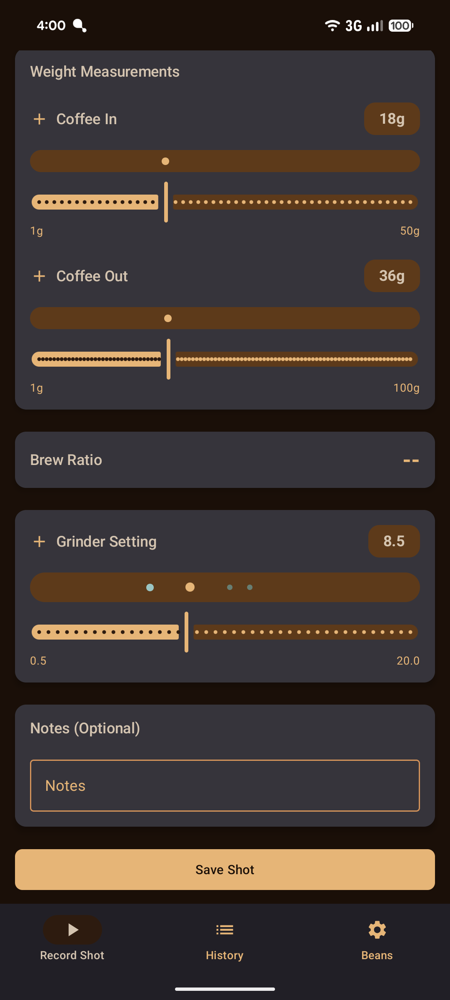

# Store entries
## EN-US
### App-Name
Coffee Shot Timer

### Short description
Espresso timer with analytics for home baristas

### Full description

The precision app for perfect espresso extraction

Coffee Shot Timer was built specifically for espresso machine enthusiasts who want to systematically take their brewing skills to the next level. The app combines intelligent timing with detailed data capture.

What you can expect:

Timer with visual feedback: Large, touch-friendly timer display with color-coded visualization. Optimal extraction times are signaled through color changes - you'll instantly know when your shot is running perfectly.

Weight documentation: Track coffee input and espresso output through intuitive sliders. The app automatically calculates your brew ratio and shows you when you're hitting the sweet spot.

Smart bean management: Manage your coffee beans with roast dates and automatic freshness indicators. The app lets you know when beans are still too fresh or past their prime.

Comprehensive documentation: Record grinder settings, extraction times, and tasting notes. Every shot is saved with all relevant parameters - so you'll never forget a successful setup again.

Analysis and optimization: Visualize your brewing patterns over time and spot trends. The history feature helps you reproduce and develop successful settings.

Designed for daily use:
- Works completely offline - perfect even without WiFi
- Automatic draft saving prevents data loss
- Quick input during active brewing
- Large interface elements for relaxed operation

Perfect fit if you:
- Own an espresso machine or manual espresso maker
- Want reproducible results
- Like to learn systematically
- Want to refine your technique

The app supports you in achieving consistent espresso quality and developing your personal taste preferences. Through the structured approach, you'll gradually improve your brewing skills.

Coffee Shot Timer transforms espresso making from guesswork into precise craftsmanship - without any stress.

### App icon

### App banner

### Screenshots

